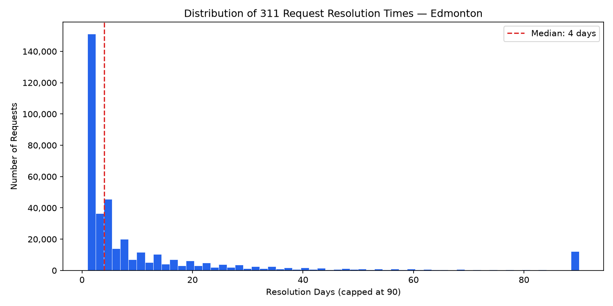
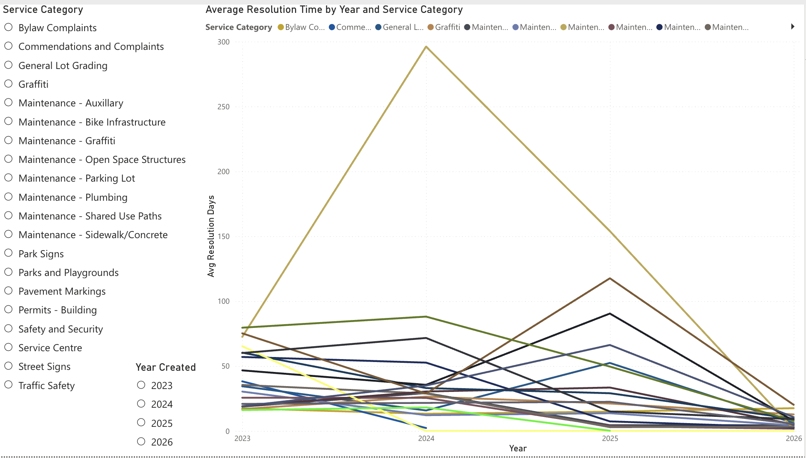
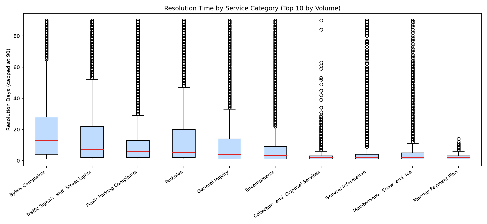
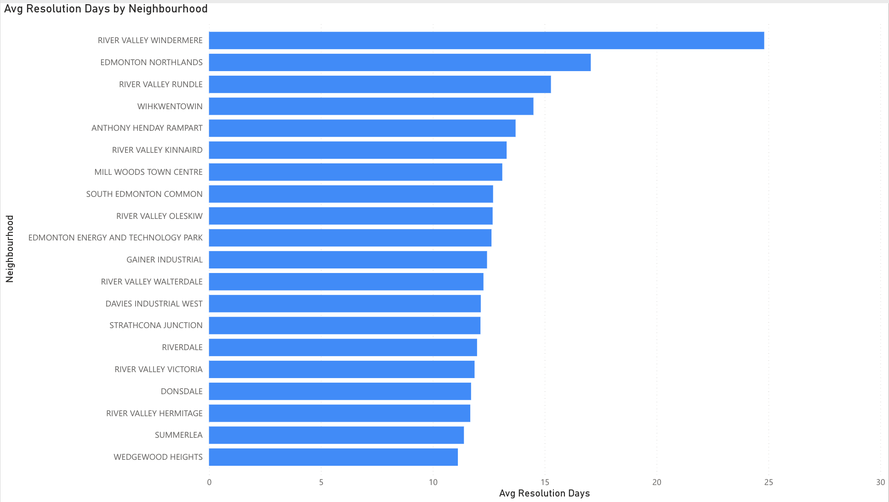
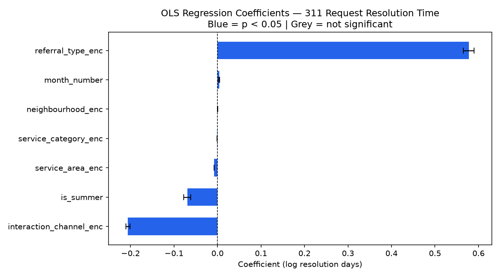
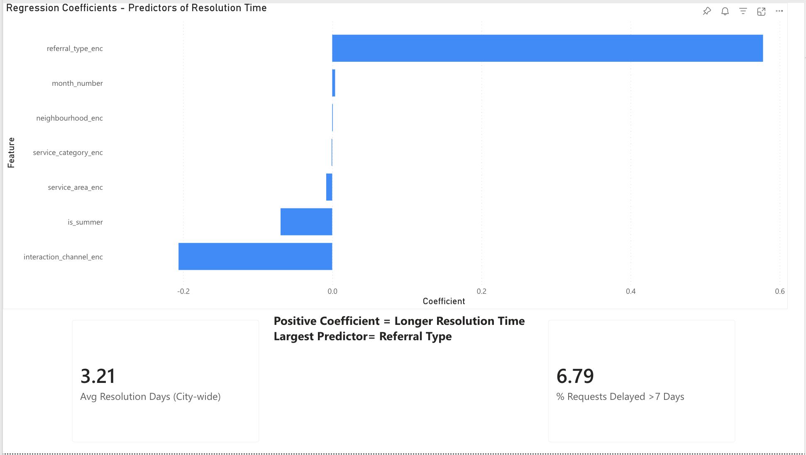

# Edmonton 311 Service Request Analysis

## Overview

This project analyzes Edmonton's 311 service request data to identify which request types and neighbourhoods experience the longest resolution delays, quantify the factors driving those delays using regression analysis, and recommend where the city should focus service delivery improvements.

The analysis covers 3.2 million requests submitted between 2023 and 2026, filtered to requests requiring active follow-up (resolution time of 1 day or more) to focus on service delivery rather than information provision.

---

## Problem Statement

Not all 311 requests are equal. Some are resolved same-day, others take months. This analysis asks: **which service categories, neighbourhoods, and time periods experience the longest resolution delays, and what predicts them?**

The answer has direct operational implications. The city can use these findings to allocate field resources, set realistic service level agreements, and identify departments with systemic backlogs.

---

## Key Findings

**Most requests are resolved quickly, but a meaningful minority are not.**

Across all service requests requiring active follow-up, the city-wide average resolution time is 3.21 days. However, 6.79% of requests take more than 7 days -- and within that group, some categories average months. This means the system works well for the majority of residents, but a specific subset of request types consistently fail to meet reasonable turnaround expectations. The distribution is heavily right-skewed: most requests close fast, while a long tail of complex or deprioritized requests drags on.



**Certain service categories have structural delay problems, not just occasional slowdowns.**

Maintenance categories involving physical infrastructure -- sidewalks, pavement markings, park signs, graffiti -- average 40 to 75 days across all years. This is not noise. These categories require field crews, equipment, and scheduling, and the data shows they consistently fall behind. Bylaw Complaints average 16 days with 45% of requests exceeding 7 days, which matters because bylaw issues often affect quality of life for multiple residents and escalate when unresolved.

The most striking case is Maintenance - Graffiti, which spiked to 295 days average in 2024 before dropping sharply. A near-tenfold increase in a single year points to a specific operational failure -- not a gradual trend -- and the recovery in 2025 suggests it was eventually addressed, but without a documented root cause it could recur.





**Where you live affects how fast your request gets resolved.**

River Valley Windermere averages 25 days -- nearly 8x the city-wide average of 3.21 days. Seven of the top 20 slowest neighbourhoods are River Valley areas, which reflects genuine operational constraints: difficult terrain, limited vehicle access, and seasonal restrictions make maintenance inherently harder there. However, the data also shows that South Edmonton Common and Mill Woods Town Centre -- high-traffic commercial areas with straightforward access -- appear in the top 20. That is harder to explain by geography alone and warrants a closer look at how requests in those areas are triaged and assigned.



**How a request is handled matters more than where it comes from.**

The OLS regression identifies referral type as the single strongest predictor of resolution time. When a 311 agent resolves a request at first contact -- providing information directly -- it closes fast. When it gets referred to a city department, resolution time increases substantially. This makes intuitive sense: referrals add handoff time, departmental queues, and coordination overhead. But it also means a significant portion of delays are not inherent to the request type -- they are a function of process design.

The second most important finding is that interaction channel has a negative coefficient, meaning requests submitted digitally (via the app or online) resolve faster than those submitted by phone. This is likely because digital submissions are structured and pre-categorized, reducing processing time, while phone calls require manual transcription and classification by an agent.





---

## Recommendations

**1. Reduce unnecessary referrals through first-contact resolution training.** Referral type is the dominant predictor of resolution time in the model. Every unnecessary referral adds queue time and coordination overhead. The city should audit which request types are most frequently referred when they could be resolved at first contact, and expand agent authority or decision-making tools accordingly. Even a 10% reduction in referral rate across high-volume categories would meaningfully improve average resolution times.

**2. Promote digital channels in high-volume neighbourhoods.** Requests submitted through the app or online resolve faster than phone calls, likely because they arrive pre-structured and pre-categorized. The city should run targeted outreach campaigns in neighbourhoods with high 311 phone volume to shift submissions to digital channels. This improves resolution times without requiring additional staff.

**3. Conduct a post-mortem on the 2024 Maintenance - Graffiti backlog.** A 295-day average in 2024 followed by a sharp recovery in 2025 indicates a specific operational failure rather than a gradual trend. Understanding what caused it -- and what fixed it -- is essential to preventing recurrence. If the recovery was due to a one-time resource injection rather than a process improvement, the backlog risk remains.

**4. Set differentiated service level targets by category.** The current data shows that treating all requests the same way is not realistic. Physical infrastructure maintenance genuinely takes longer than information requests. The city should establish and publish category-specific SLA targets based on historical performance, which would make delay reporting more meaningful and give operations managers clearer accountability benchmarks.

---

## Repository Structure

```
edmonton-311-analysis/
├── data/
│   └── requests.db          # SQLite database (gitignored)
├── sql/
│   ├── 01_service_category_breakdown.sql
│   ├── 02_seasonal_trends.sql
│   ├── 03_neighbourhood_ranking.sql
│   └── 04_export_for_powerbi.sql
├── src/
│   ├── 01_load_data.py      # Download + ingest to SQLite
│   ├── 02_eda.py            # Distribution analysis + Kruskal-Wallis tests
│   └── 03_regression.py     # OLS regression with statsmodels
├── outputs/                 # Generated charts and exports (gitignored)
├── requirements.txt
└── README.md
```

---

## Reproducing the Analysis

**Requirements**

```bash
python -m venv .venv
source .venv/bin/activate
pip install -r requirements.txt
```

**Run in order**

```bash
python src/01_load_data.py   # Downloads 3.2M rows and loads into SQLite
python src/02_eda.py         # EDA, significance tests, feature engineering
python src/03_regression.py  # OLS model, coefficient export
```

**SQL queries**

```bash
sqlite3 data/requests.db < sql/01_service_category_breakdown.sql
sqlite3 data/requests.db < sql/02_seasonal_trends.sql
sqlite3 data/requests.db < sql/03_neighbourhood_ranking.sql
sqlite3 -csv -header data/requests.db < sql/04_export_for_powerbi.sql > outputs/powerbi_export.csv
```

---

## Dashboard

Built in Power BI (web). Three pages:

| Page | Content |
|------|---------|
| **Trends** | Average resolution time by year and service category; slicers for category and year |
| **Neighbourhood Delays** | Top 20 neighbourhoods by average resolution time |
| **Model Findings** | OLS regression coefficients; KPI cards for city-wide avg and % delayed |

---

## Data Source

City of Edmonton Open Data -- 311 Requests  
[https://data.edmonton.ca/City-Administration/311-Requests/q7ua-agfg](https://data.edmonton.ca/City-Administration/311-Requests/q7ua-agfg)

3,197,871 rows. Updated regularly. Analysis run on data through June 2026.